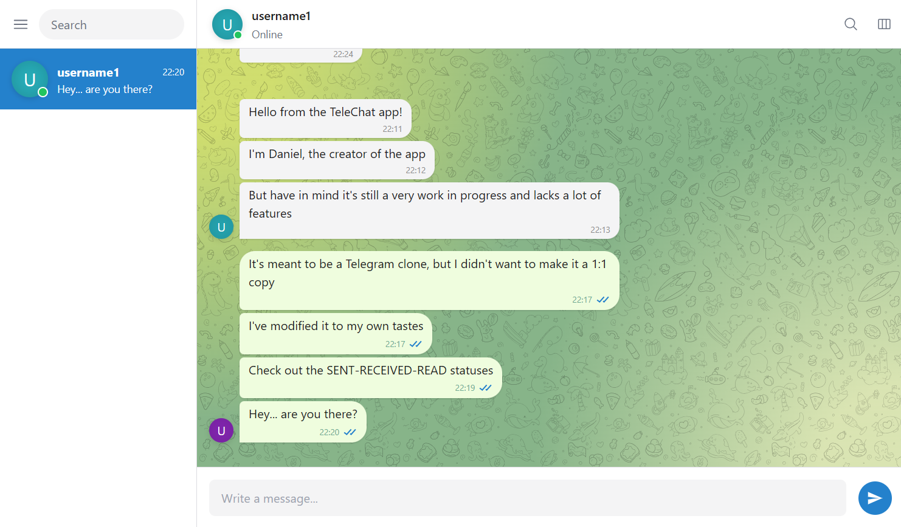
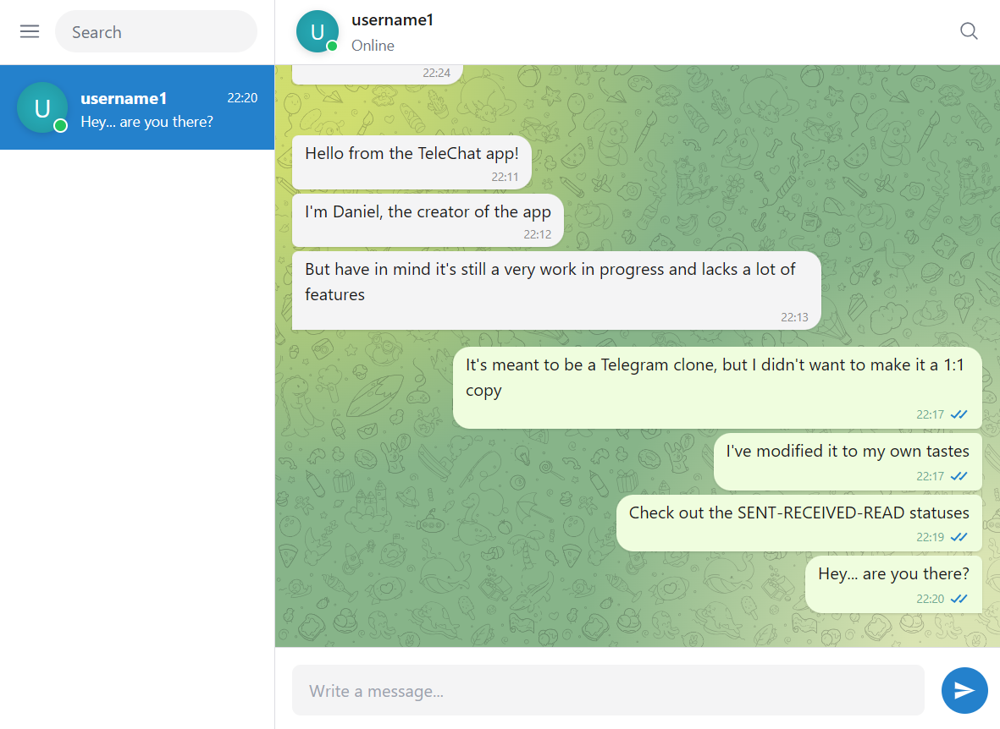
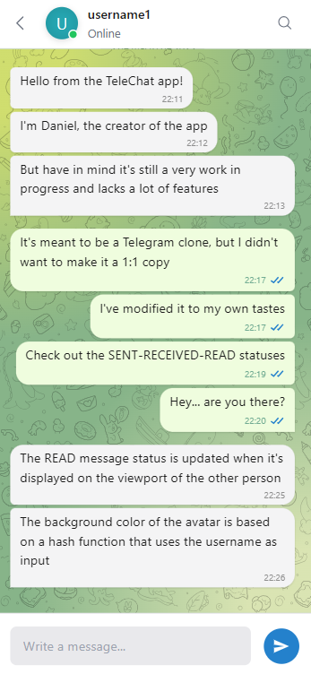
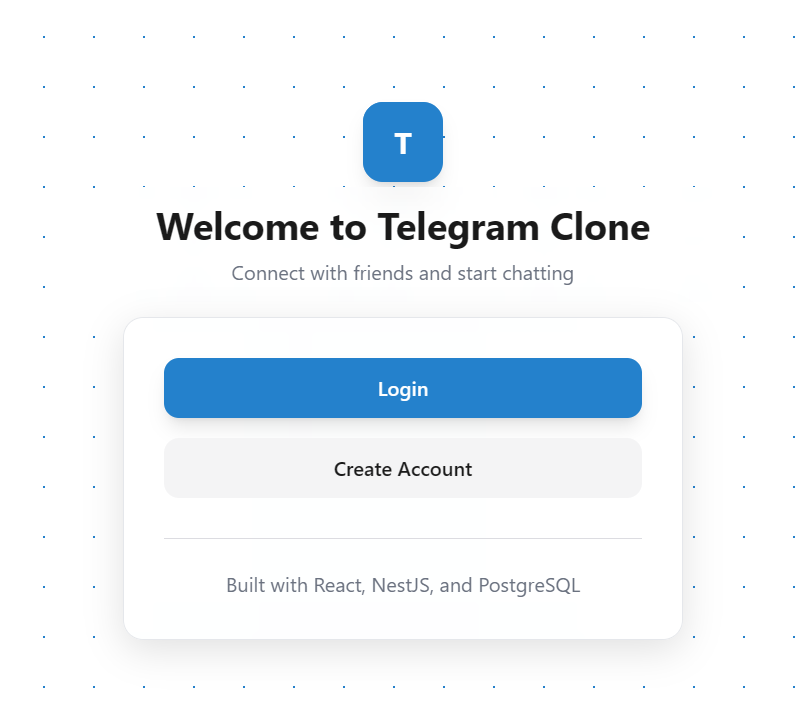
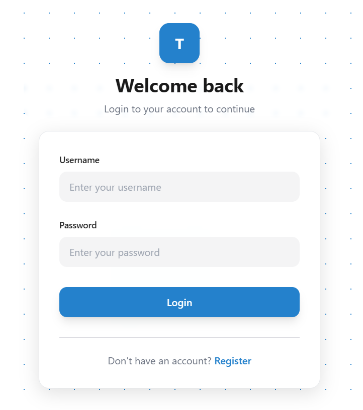
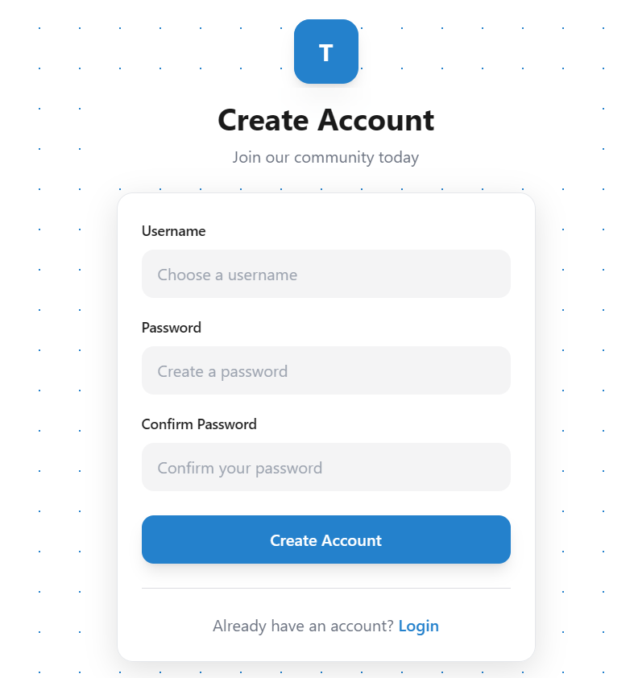

# Telechat — Telegram Clone

A full-stack real-time messaging app built to showcase backend engineering skills: modular NestJS architecture, WebSocket communication, push notifications, CI/CD pipelines, and production deployment on a VPS.

---

## 📱 Screenshots

### Chat Interface

<div align="center">
  
  <p><em>Desktop — sidebar + chat + info panel</em></p>
</div>

<div align="center">
  
  <p><em>Tablet — sidebar + chat</em></p>
</div>

<div align="center">
  
  <p><em>Mobile — full-screen chat</em></p>
</div>

### Authentication

<div align="center" style="display: flex; justify-content: space-around; flex-wrap: wrap;">
  <div style="margin: 10px;">
    
    <p><em>Home</em></p>
  </div>
  <div style="margin: 10px;">
    
    <p><em>Login</em></p>
  </div>
  <div style="margin: 10px;">
    
    <p><em>Register</em></p>
  </div>
</div>

---

## ✨ Features

- **Real-time messaging** — instant delivery via WebSocket, with sent → delivered → read status tracking
- **Group chats** — create groups, manage members, assign admin roles, upload group avatars
- **Typing indicators & online presence** — live updates across all connected clients
- **Push notifications** — Web Push API with VAPID via Service Worker, works in background
- **Offline sync** — messages cached in IndexedDB (Dexie), auto-synced on reconnect
- **User management** — registration, login, editable profiles with avatars, user blocking
- **Theme customization** — light/dark mode, 6 accent colors, customizable chat backgrounds and font sizes
- **Responsive design** — mobile, tablet, and desktop layouts

---

## 🛠️ Tech Stack

### Backend

| Technology | Role |
|---|---|
| **NestJS** | Modular, decorator-based Node.js framework with dependency injection |
| **PostgreSQL** | Primary relational database |
| **Prisma ORM** | Type-safe DB client, schema-first migrations |
| **Socket.io** | WebSocket server — messages, presence, typing, read receipts |
| **JWT + bcryptjs** | Stateless authentication with hashed passwords |
| **Web Push (VAPID)** | Push notification delivery via Service Worker |
| **Multer** | Multipart file upload handling |
| **@nestjs/schedule** | Cron jobs for periodic background tasks |
| **Vitest** | Unit testing with mocked Prisma client |

### Frontend

| Technology | Role |
|---|---|
| **React 18** | Component-driven UI with hooks |
| **TypeScript** | End-to-end type safety |
| **Vite** | Fast dev server and optimized builds |
| **Tailwind CSS** | Utility-first styling with CSS variable theming |
| **Zustand** | Lightweight reactive state management |
| **Socket.io-client** | WebSocket client |
| **Dexie (IndexedDB)** | Client-side message cache for offline support |
| **Zod** | Runtime schema validation |
| **Vitest + Testing Library** | Component and interaction testing |

### Monorepo & Tooling

| Technology | Role |
|---|---|
| **pnpm workspaces** | Monorepo managing `server/`, `web/`, `shared/` packages |
| **Shared package** | DTOs and WebSocket event types consumed by both ends |
| **GitHub Actions** | CI/CD — test, build, deploy on every push |
| **Nginx** | Reverse proxy routing frontend/API, WebSocket upgrades |
| **Let's Encrypt** | Automated TLS certificate provisioning |

---

## 🏗️ Architecture

```
telegram-clone/          # pnpm workspace root
├── server/              # NestJS backend
│   ├── prisma/          # Schema + migrations
│   └── src/
│       ├── auth/        # JWT auth (global guard)
│       ├── chat/        # REST controller + Socket.io gateway
│       ├── user/        # User management
│       ├── notification/# Web Push service
│       ├── upload/      # Multer file handling
│       └── db/          # Prisma module
├── web/                 # React frontend
│   └── src/
│       ├── components/  # UI components
│       ├── pages/       # Route-level pages
│       ├── stores/      # Zustand state stores
│       └── services/    # API, Socket, Dexie, notifications
├── shared/              # Shared TypeScript types & DTOs
└── e2e/                 # End-to-end tests
```

### Key design decisions

- **One gateway for all real-time events** — a single `ChatGateway` (`@WebSocketGateway`) handles all Socket.io events: message delivery, read receipts, typing indicators, and online/offline presence.
- **Shared type contracts** — request/response DTOs and WebSocket event enums are defined once in `shared/` and imported by both server and client, eliminating type drift.
- **Global auth guard** — the JWT guard is registered globally in `AuthModule`, with opt-out via a `@Public()` decorator for open endpoints.
- **Offline-first messaging** — the frontend stores all messages in IndexedDB via Dexie. A sync service replays missed events when the WebSocket reconnects.

---

## ⚡ WebSocket Events

The `ChatGateway` handles the following Socket.io events:

| Event | Direction | Description |
|---|---|---|
| `send-message` | client → server | Persist and broadcast a new message |
| `message-delivered` | server → client | Notify sender when recipient comes online |
| `message-read` | bidirectional | Mark messages as read, notify sender |
| `typing` | client → server → peers | Relay typing state to chat members |
| `user-online` | server → clients | Broadcast when a user connects |
| `user-offline` | server → clients | Broadcast when a user disconnects |

---

## 🚀 CI/CD & Deployment

Every push triggers a GitHub Actions workflow: **install → test → build → deploy → DB migrations**.

Two environments run on the same VPS:

| Environment | Branch | URL | Access |
|---|---|---|---|
| **Production** | `master` | main domain | Public, SSL via Let's Encrypt |
| **Development** | `develop` | subdomain | Password-protected at Nginx level |

**Infrastructure:**
- NestJS API, React static files, and PostgreSQL all hosted on a single VPS
- Nginx reverse proxy routes `/api` to NestJS and everything else to the React build, with WebSocket upgrade support
- Prisma migrations run automatically as part of the deployment script

---

## 🧪 Testing

```bash
# Run backend tests
cd server && pnpm test

# Run frontend tests
cd web && pnpm test

# Run with coverage
cd server && pnpm test:cov
cd web && pnpm test:cov
```

- **Backend** — Vitest with mocked Prisma client; service-level unit tests for auth, chat, and user modules
- **Frontend** — Vitest + `@testing-library/react` + `@testing-library/user-event`; component tests for chat and message input
- **E2E** — Playwright-based tests in the `e2e/` package

---

## 🔧 Local Setup

### Prerequisites

- Node.js ≥ 22
- pnpm
- PostgreSQL

### 1. Clone & install

```bash
git clone https://github.com/daniserrano7/telegram-clone.git
cd telegram-clone
pnpm install
```

### 2. Environment variables

```bash
# Server
cp server/.env.example server/.env.dev
# Fill in: DATABASE_URL, JWT_SECRET, ALLOWED_ORIGINS, VAPID_* keys

# Web
cp web/.env.example web/.env
# Fill in: VITE_API_URL, VITE_WS_URL, VITE_VAPID_PUBLIC_KEY
```

Generate VAPID keys for push notifications:

```bash
npx web-push generate-vapid-keys
```

### 3. Database

```bash
cd server
pnpm prisma-push:dev   # Push schema to DB (dev)
```

### 4. Run

```bash
# From root — starts both server and web in parallel
pnpm dev
```

App runs at `http://localhost:3000`, API at `http://localhost:5000/api`.

---

## 📫 Contact

- GitHub: [@daniserrano7](https://github.com/daniserrano7)

---

_This project is for portfolio/educational purposes and is not affiliated with Telegram._
